<div align="center">
  
</div>
<div align="center">

</div>

---


## Sobre mim

```yaml
nome:       Kaiki Ribeiro
localização: Brasil 🇧🇷
status:     Cursando Engenharia de Software
foco:       Desenvolvimento & resolução de problemas
hobby:      Jogos, programação e hardware de PC
```

---

## Tech Stack

<div align="center">

### 💻 Linguagens


### 🛠️ Ferramentas & Frameworks


</div>

---

## GitHub

<div align="center">


</div>

---

## Contribuições

<div align="center">
  
</div>

---


## Onde me encontrar

<div align="center">

[](https://www.linkedin.com/in/kaikiribeiro/)
[](https://www.instagram.com/kaikiiribeiro/)
[](mailto:kaikiribeiro943@gmail.com)

</div>


---

<div align="center">

### 💬 *"Qualquer tolo pode escrever código que um computador entende. Bons programadores escrevem código que humanos entendem."*
**— Martin Fowler**


</div>
